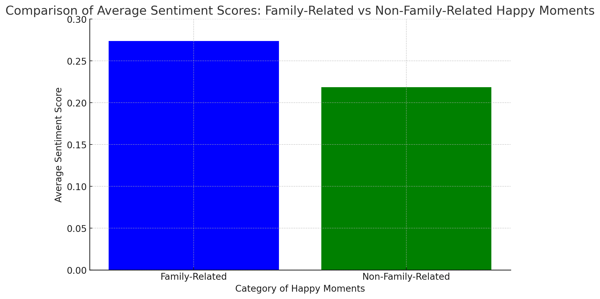

## Introduction

Many things can make one's heart smile with joy. In this project, we delve into HappyDB, a corpus of 100,000 crowd-sourced happy moments via Amazon's Mechanical Turk. You can read more about it on https://arxiv.org/abs/1801.07746. But I only use a subset of this dataset to conduct data analysis in this report.

#### This report aims to uncover the various factors contributing to happiness, based on the analysis of the 'cleaned_hm.csv' dataset from HappyDB.

  
```{r, warning=FALSE, message=FALSE,echo=FALSE}
knitr::opts_chunk$set(echo = TRUE)
```


```{r, message=FALSE, warning=FALSE,echo=FALSE}
packages.used=c("tm", "tidytext","tidyverse","DT","wordcloud","scales","gridExtra","ngram","igraph","ggraph","rsconnect")

# load packages
library(tm)
library(tidytext)
library(tidyverse)
library(DT)
library(scales)
library(wordcloud2)
library(gridExtra)
library(ngram)
library(shiny) 
```

This report is prepared with the following environmental settings.

```{r}
print(R.version)
```

```{r read data, warning=FALSE, message=FALSE,echo=FALSE}
urlfile<-'../data/cleaned_hm.csv'
hm_data <- read_csv(urlfile)
```


```{r text processing in tm,warning=FALSE, message=FALSE,echo=FALSE}
corpus <- VCorpus(VectorSource(hm_data$cleaned_hm))%>%
  tm_map(content_transformer(tolower))%>%
  tm_map(removePunctuation)%>%
  tm_map(removeNumbers)%>%
  tm_map(removeWords, character(0))%>%
  tm_map(stripWhitespace)
```


```{r stemming,warning=FALSE, message=FALSE,echo=FALSE}
stemmed <- tm_map(corpus, stemDocument) %>%
  tidy() %>%
  select(text)
```


```{r tidy dictionary,warning=FALSE, message=FALSE,echo=FALSE}
dict <- tidy(corpus) %>%
  select(text) %>%
  unnest_tokens(dictionary, text)
```


```{r stopwords,warning=FALSE, message=FALSE,echo=FALSE}
data("stop_words")

word <- c("happy","ago","yesterday","lot","today","months","month",
                 "happier","happiest","last","week","past","day","time")

stop_words <- stop_words %>%
  bind_rows(mutate(tibble(word), lexicon = "updated"))
```


```{r tidy stems with dictionary,warning=FALSE, message=FALSE,echo=FALSE}
completed <- stemmed %>%
  mutate(id = row_number()) %>%
  unnest_tokens(stems, text) %>%
  bind_cols(dict) %>%
  anti_join(stop_words, by = c("dictionary" = "word"))
```

```{r stem completion, warning=FALSE, message=FALSE,echo=FALSE}
completed <- completed %>%
  group_by(stems) %>%
  count(dictionary) %>%
  mutate(word = dictionary[which.max(n)]) %>%
  ungroup() %>%
  select(stems, word) %>%
  distinct() %>%
  right_join(completed) %>%
  select(-stems)
```


```{r reverse unnest,warning=FALSE, message=FALSE,echo=FALSE}
completed <- completed %>%
  group_by(id) %>%
  summarise(text = str_c(word, collapse = " ")) %>%
  ungroup()
```


```{r cleaned hm_data, warning=FALSE, message=FALSE,echo=FALSE}
hm_data <- hm_data %>%
  mutate(id = row_number()) %>%
  inner_join(completed)
```

```{r export data,echo=FALSE}
write_csv(hm_data, "../output/processed_moments.csv")  

```


```{r load data, warning=FALSE, message=FALSE,echo=FALSE}
hm_data <- read_csv("../output/processed_moments.csv")

urlfile<-'https://raw.githubusercontent.com/rit-public/HappyDB/master/happydb/data/demographic.csv'
demo_data <- read_csv(urlfile)
```


```{r combining data, warning=FALSE, message=FALSE,echo=FALSE}
hm_data <- hm_data %>%
  inner_join(demo_data, by = "wid") %>%
  select(wid,
         original_hm,
         gender, 
         marital, 
         parenthood,
         reflection_period,
         age, 
         country, 
         ground_truth_category, 
         text) %>%
  mutate(count = sapply(hm_data$text, wordcount)) %>%
  filter(gender %in% c("m", "f")) %>%
  filter(marital %in% c("single", "married")) %>%
  filter(parenthood %in% c("n", "y")) %>%
  filter(reflection_period %in% c("24h", "3m")) %>%
  mutate(reflection_period = fct_recode(reflection_period, 
                                        months_3 = "3m", hours_24 = "24h"))
```


```{r bag of words, warning=FALSE, message=FALSE,echo=FALSE}
bag_of_words <-  hm_data %>%
  unnest_tokens(word, text)

word_count <- bag_of_words %>%
  count(word, sort = TRUE)
```


```{r bigram, warning=FALSE, message=FALSE,echo=FALSE}
hm_bigrams <- hm_data %>%
  filter(count != 1) %>%
  unnest_tokens(bigram, text, token = "ngrams", n = 2)

bigram_counts <- hm_bigrams %>%
  separate(bigram, c("word1", "word2"), sep = " ") %>%
  count(word1, word2, sort = TRUE)
```


```{r shiny UI, warning=FALSE, message=FALSE,echo=FALSE}
ui <- navbarPage("What makes people happy?",
                 tabPanel("Overview",
                          
                          titlePanel(h1("Most Frequent Occurrences",
                                        align = "center")),
                          
                          sidebarLayout(
                            sidebarPanel(
                              sliderInput(inputId = "topWordcloud",
                                          label = "Number of terms for word cloud:",
                                          min = 5,
                                          max = 100,
                                          value = 50),
                              br(),
                              br(),
                              
                              checkboxInput(inputId = "topFreqB",
                                            label = "Plot Bar Chart",
                                            value = F),
                              sliderInput(inputId = "topBarchart",
                                          label = "Number of terms for bar chart:",
                                          min = 1,
                                          max = 25,
                                          value = 10),
                              br(),
                              br(),
                              
                              checkboxInput(inputId = "topFreqN",
                                            label = "Plot Network Graph",
                                            value = F),
                              sliderInput(inputId = "topNetwork",
                                          label = "Number of edges for network graph:",
                                          min = 1,
                                          max = 150,
                                          value = 50)
                            ),
                            
                            mainPanel(
                              wordcloud2Output(outputId = "WC"),
                              plotOutput(outputId = "figure")
                            )
                          )
                 ),
                 
                 tabPanel("Individual Terms",
                          
                          titlePanel(h1("Comparison of Proportions",
                                        align = "center")),
                          
                          sidebarLayout(
                            sidebarPanel(
                              selectInput(inputId = "attribute",
                                          label = "Select the attribute:",
                                          choices = c("Gender" = "gender",
                                                      "Marital Status" = "marital",
                                                      "Parenthood" = "parenthood",
                                                      "Reflection Period" = "reflection_period")
                              )
                            ),
                            
                            mainPanel(
                              plotOutput(outputId = "scatter")
                            )
                          )
                 ),
                 
                 tabPanel("Pair of Words",
                          
                          titlePanel(h1("Most Frequent Bigrams",
                                        align = "center")),
                          
                          sidebarLayout(
                            sidebarPanel(
                              selectInput(inputId = "factor",
                                          label = "Select the attribute:",
                                          choices = c("Gender" = "gender",
                                                      "Marital Status" = "marital",
                                                      "Parenthood" = "parenthood",
                                                      "Reflection Period" = "reflection_period")
                              ),
                              numericInput(inputId = "topBigrams",
                                          label = "Number of top pairs to view:",
                                          min = 1,
                                          max = 25,
                                          value = 10)
                            ),
                            
                            mainPanel(
                              plotOutput(outputId = "bar")
                            )
                          )
                 ),
                 
                 tabPanel("Data",
                          DT::dataTableOutput("table")
                          )
)
```

```{r shiny server, warning=FALSE, message=FALSE,echo=FALSE}
server <- function(input, output, session) {
  
  pt1 <- reactive({
    if(!input$topFreqB) return(NULL)
    word_count %>%
      slice(1:input$topBarchart) %>%
      mutate(word = reorder(word, n)) %>%
      ggplot(aes(word, n)) +
      geom_col() +
      xlab(NULL) +
      ylab("Word Frequency")+
      coord_flip()
  })
  
  pt2 <- reactive({
    if(!input$topFreqN) return(NULL)
    bigram_graph <- bigram_counts %>%
      slice(1:input$topNetwork) %>%
      graph_from_data_frame()
    
    set.seed(123)
    
    x <- grid::arrow(type = "closed", length = unit(.1, "inches"))
    
    ggraph(bigram_graph, layout = "fr") +
      geom_edge_link(aes(edge_alpha = n), show.legend = FALSE,
                     arrow = x, end_cap = circle(.05, 'inches')) +
      geom_node_point(color = "skyblue", size = 3) +
      geom_node_text(aes(label = name), repel = TRUE) +
      theme_void()
  })
  
  output$WC <- renderWordcloud2({
    
    word_count %>%
      slice(1:input$topWordcloud) %>%
      wordcloud2(size = 0.6,
                 rotateRatio = 0)
    
  })
  
  output$figure <- renderPlot(height = 500, width = 500, {
    
    ptlist <- list(pt1(),pt2())
    ptlist <- ptlist[!sapply(ptlist, is.null)]
    if(length(ptlist)==0) return(NULL)
    
    lay <- rbind(c(1,1),
                 c(2,2))
    
    grid.arrange(grobs = ptlist, layout_matrix = lay)
  })
  
  
  
  selectedAttribute <- reactive({
    list(atr = input$attribute)
  })
  
  output$scatter <- renderPlot({
    temp <- bag_of_words %>%
      count(!!as.name(selectedAttribute()$atr), word) %>%
      group_by(!!as.name(selectedAttribute()$atr)) %>%
      mutate(proportion = n / sum(n)) %>% 
      select(-n) %>% 
      spread(!!as.name(selectedAttribute()$atr), proportion)
    
      ggplot(temp, 
             aes_string(x = colnames(temp)[2], y = colnames(temp)[3]),
             color = abs(colnames(temp)[3] - colnames(temp)[2])) +
      geom_abline(color = "gray40", lty = 2) +
      geom_jitter(alpha = 0.1, size = 1, width = 0.3, height = 0.3) +
      geom_text(aes(label = word), check_overlap = TRUE, vjust = 1.5) +
      scale_x_log10(labels = percent_format()) +
      scale_y_log10(labels = percent_format()) +
      scale_color_gradient(limits = c(0, 0.001), low = "darkslategray4", high = "gray75") +
      theme(legend.position="none")
  })
  
  
  
  selectedBigram <- reactive({
    list(var = input$factor)
  })
  
  output$bar <- renderPlot({
    hm_bigrams %>%
      count(!!as.name(selectedBigram()$var), bigram, sort = TRUE) %>%
      group_by(!!as.name(selectedBigram()$var)) %>%
      top_n(input$topBigrams) %>%
      ungroup() %>%
      mutate(bigram = reorder(bigram, n)) %>%
      ggplot(aes(bigram, n, fill = !!as.name(selectedBigram()$var))) +
      geom_col(show.legend = FALSE) +
      facet_wrap(as.formula(paste("~", selectedBigram()$var)), ncol = 2, scales = "free") +
      coord_flip()
  })
  
  
  output$table <- DT::renderDataTable({
    DT::datatable(hm_data)
  })
}
```

## Question: "How do mentions of children and family life contribute to people's reported happy moments?"

Approach for Analysis:
1.Identify Mentions of Children and Family: Use text analysis to find mentions of children, parenting, or family in the cleaned_hm texts.

2.Categorize Happy Moments: Classify the happy moments into those that involve children/family and those that don't.

3.Analyze Differences: Explore any differences in the nature of happy moments between these two categories. This could include sentiment analysis, frequency of mentions, and the context in which family or children are discussed.

4.Insights: Look for patterns or insights into how children and family life contribute to individuals' happiness.

## The analysis of the cleaned_hm.csv dataset reveals the following distribution of happy moments related to family:

Happy Moments Not Mentioning Family: 78,287
Happy Moments Mentioning Family: 22,248
Out of the total happy moments analyzed, a significant number of them (22,248) contain mentions of children, parents, or other family-related terms. This indicates that a considerable portion of the reported happy moments are related to family life.

## Next Steps in Analysis:
Sentiment Analysis: Evaluate the sentiment of the happy moments that mention family. This could give us an idea of the overall tone and positivity of these moments.

## Due to the size of entire dataset, I sampled a smaller subset to 5000 to reduce computation time
Based on the sentiment analysis of a sampled subset of the dataset:



·Average Sentiment of Family-Related Happy Moments: 0.274 (approx.)
·Average Sentiment of Non-Family-Related Happy Moments: 0.218 (approx.)
This analysis suggests that, on average, happy moments related to family and children have a slightly higher positive sentiment compared to those not related to family. It indicates that mentions of family and children in happy moments are generally associated with more positive emotions.

#### Interpretation:
The findings imply that family-related aspects play a positive role in the happy moments of individuals. This could be reflective of the joy and satisfaction derived from family life and relationships with children.

## Conclusion:
Family and children play a pivotal role in shaping the happy experiences of individuals, contributing positively to their emotional well-being. This finding aligns with broader psychological and sociological research that highlights the importance of close personal relationships in enhancing life satisfaction and happiness.